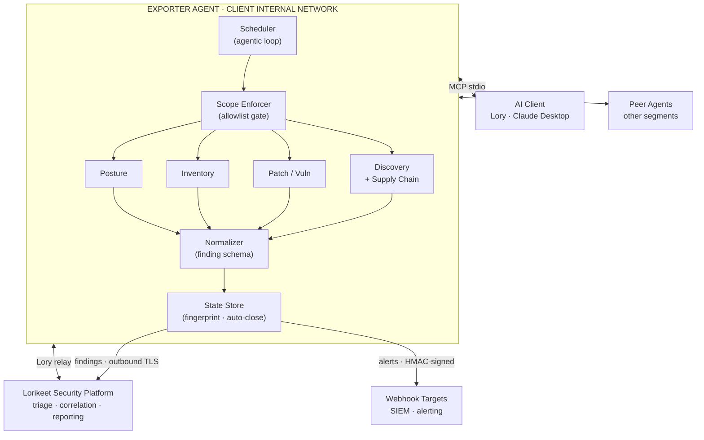

# lorikeet-security-agent-exporter


---

## Overview

The Lorikeet Security Agent Exporter is a lightweight, self-directed collection agent that runs on the inside of a network. Once authorized and scoped, it performs continuous discovery and assessment without requiring an operator to drive each scan. Results are normalized into a consistent finding schema and shipped over an authenticated, outbound-only channel to the Lorikeet Security platform, where they feed into PTaaS workflows, dashboards, and reporting.

Think of it as the internal-network analogue to external attack-surface management: persistent, prioritized, and built to surface what changed and what is newly exploitable, not just what existed at scan time.

---

## Why an agentic exporter

Traditional internal assessment is episodic. A tester connects, runs a fixed scan profile, exports results, and leaves. Between engagements the network drifts: hosts are added, patches lapse, services get exposed, and configurations rot. None of that is visible until the next engagement.

The agentic model changes the loop:

- **Continuous, not point-in-time.** The agent runs on a cadence (or continuously) and tracks state over time, so drift and regressions are caught as they happen.
- **Self-prioritizing.** Rather than re-running an identical scan list, the agent decides what to look at next based on what it has already found: new hosts, changed services, high-severity exposures.
- **Low-touch deployment.** A single agent inside the perimeter replaces ad-hoc tooling and manual data collection.
- **Platform-native.** Findings land directly in the Lorikeet Security platform in a structured form, ready for correlation against external ASM data and prior engagement history.

---

## Capabilities

### Host & service discovery
Sweeps authorized internal ranges, fingerprints live hosts, identifies open ports, and classifies exposed services. Tracks newly appeared and newly disappeared hosts between collection cycles. Bundled supply chain analysis (npm + OSV + malicious-package detection) runs automatically alongside discovery.

### Patch & vulnerability state
Collects OS patch levels and installed-package manifests, then maps them against known-CVE data to flag missing patches, end-of-life software, and known-exploitable versions. Prioritizes by severity and exploitability rather than raw CVE count.

### Server & application inventory
Builds and maintains a running inventory of operating systems, installed software, running services, listening ports, and notable configuration. Detects configuration drift and inventory changes over time.

### Patch-management visibility
Surfaces patch compliance posture across the fleet: which hosts are current, which are lagging, and which carry known-exploited vulnerabilities, so remediation can be prioritized where it matters.

### Remediation tracking
Findings are fingerprinted (asset + check type + key detail) and tracked across cycles. When a finding is absent for a configurable number of consecutive cycles it is automatically marked closed and a close notification is sent to the platform, so resolved issues don't linger in the queue.

### Structured findings export
Normalizes all collected data into a single finding schema and streams it to the platform over an authenticated channel for triage, deduplication, and reporting. Standalone mode (no platform URL) prints findings as JSON to stdout for piping to a SIEM or custom sink.

### Agentic operation
Runs unattended. Schedules its own collection cycles, sequences modules, and adapts its focus to the current state of the environment. Exposes an MCP server for on-demand tool calls from AI systems including Lory and Claude Desktop.

---

## Architecture



**Design principles**

- **Scope enforcement is a hard gate, not a filter.** Every target is checked against the configured allowlist before any collector touches it. Out-of-scope hosts are never contacted.
- **Outbound-only.** The agent initiates all connections to the platform; the platform never reaches into the network.
- **Modular collectors.** Each collector is independently enable/disable-able so deployments can be tuned to the engagement.
- **Findings are fingerprinted.** The same issue never floods the platform; only new or changed findings are shipped each cycle.

---

## Collector modules

| Module         | Collects                                                                 | Notes |
| -------------- | ------------------------------------------------------------------------ | ----- |
| `discovery`    | Live hosts, open ports, service fingerprints, host churn; npm packages + OSV CVE lookup + malicious-package detection (supply chain) | Baseline module; recommended always-on. Supply chain runs automatically within this module. |
| `patch`        | OS patch level, installed-package manifest, CVE mapping, EOL software    | Severity- and exploitability-prioritized |
| `inventory`    | OS/version, installed software, running services, config drift           | Tracks change over time |
| `posture`      | Patch-compliance rollup across the fleet, known-exploited flags          | Built on `patch` + `inventory` output; always runs last |

Modules are selected in configuration via the `modules` setting. Disabled modules consume no resources and contact no hosts.

---

## MCP tools

When the agent runs in MCP mode (`lk-exporter mcp` or `lk-exporter run --agent-mode`), it exposes the following tools to any MCP client:

| Tool | Category | Description |
| ---- | -------- | ----------- |
| `trigger_collection` | Control | Run an on-demand cycle — all enabled modules or a named subset |
| `get_findings` | Query | Return findings from the most recent cycle; filter by severity or module |
| `get_closed_findings` | Query | Return findings auto-closed by the remediation-tracking loop |
| `get_status` | Query | Agent health, scope summary, modules, last cycle time, and severity breakdown |
| `validate_scope` | Scope | Check whether a host, IP, or CIDR is inside the configured allowlist |
| `list_scope` | Scope | List all scope entries and estimated IP count |
| `scan_host` | Pentest | Port + service scan via nmap (or pure-Python TCP fallback) |
| `discover_hosts` | Pentest | Live host discovery across all scope ranges via nmap ping sweep |
| `grab_banner` | Pentest | Capture a TCP service banner; TLS-aware |
| `check_web_endpoint` | Pentest | HTTP/S GET probe — status code, security headers, body snippet |
| `run_nmap_script` | Pentest | Run a named NSE script; exploit/brute/dos categories are blocked |
| `dns_lookup` | Pentest | Forward A-record resolution + reverse PTR lookup |
| `list_peers` | Mesh | Health and status of all configured peer agents |
| `get_peer_findings` | Mesh | Pull findings and discovered hosts from one or all peer agents |

All pentest tools validate scope before making any network call. Out-of-scope targets are rejected and no traffic is sent.

---

## Finding schema

All collectors emit findings in a single normalized envelope so the platform can ingest them uniformly:

```json
{
  "finding_id": "uuid",
  "agent_id": "uuid",
  "collected_at": "2026-06-06T00:00:00Z",
  "module": "patch",
  "target": {
    "host": "10.0.4.12",
    "hostname": "app-prod-04",
    "in_scope": true
  },
  "category": "missing-patch",
  "severity": "high",
  "title": "Missing OS security update",
  "evidence": {
    "cve": ["CVE-2026-XXXXX"],
    "installed_version": "1.2.3",
    "fixed_version": "1.2.7"
  },
  "first_seen": "2026-06-01T00:00:00Z",
  "last_seen": "2026-06-06T00:00:00Z",
  "state": "open"
}
```

`first_seen`, `last_seen`, and `state` give the platform the temporal context needed to distinguish new exposures from persistent ones and to auto-close findings that have been remediated.

---

## Scope & authorization

> **This tool is for authorized internal assessment only.**

The exporter enforces an explicit scope definition and will **not** collect against hosts outside the configured allowlist. The scope enforcer runs as a code-level gate ahead of every collector and every MCP pentest tool; there is no mode in which the agent operates without a scope.

Deploy only on networks you own or are **contractually engaged** to test. Unauthorized scanning of networks you do not control may be illegal in your jurisdiction.

---

## Installation

**Requirements:** Python 3.11+. `nmap` is optional but recommended — the discovery and pentest tools fall back to pure-Python TCP probes when nmap is absent, with reduced coverage.

### Recommended: virtual environment (all platforms)

```bash
git clone https://github.com/Lorikeet-Security/lorikeet-security-agent-exporter.git
cd lorikeet-security-agent-exporter

python -m venv .venv
source .venv/bin/activate   # Windows: .venv\Scripts\activate
pip install -e .
```

Editable installs (`-e`) mean local code changes take effect immediately without reinstalling.

### System-wide install

Some Linux distributions (Arch, Debian 12+, Ubuntu 23.04+) enforce [PEP 668](https://peps.python.org/pep-0668/) and block system-wide pip installs by default. Pass `--break-system-packages` to override — a virtualenv is still preferable for production deployments.

```bash
# From PyPI
pip install lorikeet-security-agent-exporter --break-system-packages

# From source (after cloning)
pip install -e . --break-system-packages

# From GitHub (latest main)
pip install git+https://github.com/Lorikeet-Security/lorikeet-security-agent-exporter.git --break-system-packages
```

All methods register the `lk-exporter` console entry point on your `PATH`.

---

## Configuration

Configuration is supplied via a YAML config file (default `config.yaml`) or environment variables. Environment variables take precedence over file values.

### Core settings

| Setting        | Required | Env var | Description |
| -------------- | -------- | ------- | ----------- |
| `scope`        | yes      | —       | CIDR ranges / hostnames the agent is authorized to touch |
| `agent_id`     | no       | —       | Stable identity string. Auto-generated on first run and persisted to `.lk_state/agent.json`; pin here to survive reinstalls |
| `platform_url` | no       | `LK_PLATFORM_URL` | Lorikeet Security platform ingest endpoint (omit for standalone / self-hosted sink) |
| `license_key`  | if platform | `LK_LICENSE_KEY` | Platform license key. Required for platform ingest |
| `agent_token`  | if platform | `LK_AGENT_TOKEN` | Per-deployment agent authentication token |
| `interval`     | no       | `LK_INTERVAL` | Collection cadence: `continuous`, or e.g. `6h`, `24h`, `30m` |
| `modules`      | no       | —       | Enabled collectors: `discovery`, `patch`, `inventory`, `posture` |
| `concurrency`  | no       | `LK_CONCURRENCY` | Max parallel host operations per cycle (default: `16`) |
| `log_level`    | no       | `LK_LOG_LEVEL` | `info` (default), `debug`, `warn`, `error` |

### Multi-agent mesh

| Setting | Required | Env var | Description |
| ------- | -------- | ------- | ----------- |
| `coordinator_port` | no | `LK_COORDINATOR_PORT` | Start a peer coordinator HTTP API on this port; disabled by default |
| `peer_secret` | no | `LK_PEER_SECRET` | Shared Bearer token for peer-to-peer authentication |
| `peers` | no | — | List of peer coordinator URLs to pull findings and hosts from each cycle |

### Remediation tracking

| Setting | Required | Description |
| ------- | -------- | ----------- |
| `auto_close_enabled` | no | Auto-resolve findings absent for `auto_close_grace_cycles` consecutive cycles (default: `true`) |
| `auto_close_grace_cycles` | no | Consecutive cycles a finding must be absent before it is auto-closed (default: `2`) |

### Webhooks

| Setting | Required | Description |
| ------- | -------- | ----------- |
| `webhooks` | no | List of `{url, severity_threshold, secret}` objects. Fires an HMAC-signed HTTP POST per cycle for findings at or above the threshold |

### Example config

```yaml
scope:
  - 10.0.0.0/16
  - 192.168.50.0/24
platform_url: https://lorikeetsecurity.com/ingest
license_key: ${LK_LICENSE_KEY}
agent_token: ${LK_AGENT_TOKEN}
interval: 6h
modules:
  - discovery
  - patch
  - inventory
  - posture
concurrency: 16
log_level: info

# Multi-agent mesh (optional)
coordinator_port: 8765
peer_secret: ${LK_PEER_SECRET}
peers:
  - http://10.1.0.5:8765   # DMZ agent
  - http://10.2.0.9:8765   # OT segment agent

# Remediation tracking
auto_close_enabled: true
auto_close_grace_cycles: 2

# Webhooks (optional)
webhooks:
  - url: https://hooks.example.com/security
    severity_threshold: high
    secret: ${LK_WEBHOOK_SECRET}
```

---

## Running the agent

```bash
# show version and licensing info
lk-exporter --version

# quick config check (validates config.yaml and exits)
lk-exporter --test-config

# continuous agentic operation (quiet by default)
lk-exporter run

# one-shot collection cycle
lk-exporter run --once

# point at a specific config file
lk-exporter run --config /etc/lorikeet/config.yaml

# verbose output — full INFO logs and per-cycle findings table
lk-exporter run --verbose

# start the agent + MCP stdio server simultaneously (for Lory / Claude Desktop)
lk-exporter run --agent-mode

# full validation of config, scope, and platform reachability
lk-exporter validate
lk-exporter validate --config /etc/lorikeet/config.yaml

# start MCP stdio server only (no scheduled collection)
lk-exporter mcp
```

By default the agent runs quietly: after startup it prints a single status line and then a one-line summary per collection cycle (finding count with critical/high breakdown). Pass `--verbose` / `-v` to see full INFO logs and the per-cycle findings table.

The CLI is also available as a module if the console script is not on your `PATH`:

```bash
python -m lk_exporter run --once
```

**`--test-config`** is a quick sanity check for the default `config.yaml`: it validates the file, enumerates the scope, and (if `platform_url` is set) checks the license key and platform reachability, then exits. For a non-default config path use `lk-exporter validate --config path`.

**`validate`** is recommended before every new deployment. It confirms the scope parses correctly and the allowlist is non-empty, and, if platform ingest is configured, that the license key is valid and the endpoint is reachable and authenticated, without contacting any target hosts.

**`run --agent-mode`** starts the background collection loop **and** the MCP stdio server simultaneously. If `platform_url` is configured it also starts the Lory relay — a background poller that checks the platform for tool calls queued by Lory AI and dispatches them to the local MCP tool functions.

**`mcp`** starts only the MCP server with no autonomous scanning. The AI client drives all activity via tool calls. Use this when you want the AI to be the sole orchestrator with no background scans between tool calls.

### Standalone / SIEM mode

When `platform_url` is not set, findings print as newline-delimited JSON to stdout:

```bash
# pipe to jq for human-readable output
lk-exporter run --once | jq .

# stream into a file or forward to a SIEM ingestion endpoint
lk-exporter run | tee findings.jsonl
```

---

## Multi-agent mesh

A single agent can only reach one network segment. When multiple agents are deployed across segmented environments (internal LAN, DMZ, OT network, cloud VPC), they can form a mesh so the full network picture is visible without centralizing control.

**How it works:**
1. Each agent optionally runs a **coordinator HTTP API** (`coordinator_port`) that exposes its latest findings and discovered hosts.
2. Agents list their **peers** and pull findings + host lists from them after each collection cycle.
3. Pulled hosts are fed into downstream collectors so the local agent can assess assets it cannot directly discover.
4. Peer findings are correlated locally and displayed via MCP tools (`list_peers`, `get_peer_findings`) but are not re-exported to the platform (to avoid double-counting).
5. A shared `peer_secret` authenticates peer-to-peer traffic.

```yaml
# Agent on the internal LAN — runs coordinator and knows about the DMZ agent
coordinator_port: 8765
peer_secret: ${LK_PEER_SECRET}
peers:
  - http://10.1.0.5:8765   # DMZ segment agent
```

---

## Deployment patterns

### Systemd service (continuous)

```ini
[Unit]
Description=Lorikeet Security Agent Exporter
After=network-online.target
Wants=network-online.target

[Service]
Type=simple
User=lk-exporter
WorkingDirectory=/opt/lk-exporter
EnvironmentFile=/opt/lk-exporter/.env
ExecStart=/opt/lk-exporter/.venv/bin/lk-exporter run
Restart=on-failure
RestartSec=30

[Install]
WantedBy=multi-user.target
```

### Cron / systemd timer (one-shot)

```bash
# /etc/cron.d/lk-exporter
0 */6 * * * lk-exporter /opt/lk-exporter/.venv/bin/lk-exporter run --once \
    --config /opt/lk-exporter/config.yaml >> /var/log/lk-exporter.log 2>&1
```

### Docker

```dockerfile
FROM python:3.12-slim
RUN apt-get update && apt-get install -y nmap && rm -rf /var/lib/apt/lists/*
WORKDIR /app
COPY . .
RUN pip install -e . --no-cache-dir
VOLUME ["/app/.lk_state"]
ENTRYPOINT ["lk-exporter"]
CMD ["run"]
```

```bash
docker run -d \
  -v $(pwd)/config.yaml:/app/config.yaml:ro \
  -v lk-state:/app/.lk_state \
  -e LK_LICENSE_KEY=lk_lic_... \
  -e LK_AGENT_TOKEN=lk_agent_... \
  lorikeet-security-agent-exporter
```

### Claude Desktop (MCP)

Add to `claude_desktop_config.json` under `"mcpServers"`:

```json
"lk-exporter": {
  "command": "/usr/local/bin/lk-exporter",
  "args": ["mcp", "--config", "/etc/lorikeet/config.yaml"]
}
```

Claude Desktop launches the process, connects over stdio, and makes all MCP tools available in every conversation automatically.

### Lory AI (platform relay)

In the Lorikeet Security platform → Agent Settings, set the agent command:

```
lk-exporter run --agent-mode --config /path/to/config.yaml
```

Lory connects via the platform relay (not direct stdio), so `--agent-mode` is required over bare `mcp`.

---

## Licensing

The agent is open source (MIT) and runs freely. You can clone it, read it, fork it, and run collection against your own scope without any key.

A **license key** is required only to **ingest findings into the hosted Lorikeet Security platform**. It is the platform entitlement, not a gate on the software itself. The key is separate from the `agent_token`: the license authorizes platform ingest, the token authenticates the connection. If you are running the agent standalone or exporting to your own sink, no license key is needed.

License keys are issued per customer from the Lorikeet Security platform and take the form:

```
lk_lic_<32 hex chars>
```

When a `platform_url` pointing at the Lorikeet Security platform is configured, the agent validates the license key online before streaming findings. If the key is missing, malformed, expired, or revoked, platform ingest is rejected; local collection still runs and can be exported elsewhere. License validation is also exercised during `lk-exporter validate`.

License keys may encode entitlements such as seat/agent count, enabled hosted features, and an expiry date, which the platform enforces at validation time. Treat the license key as a secret:

- Supply it via environment variable or secret manager, never commit it to the repo.
- Contact Lorikeet Security to rotate, extend, or revoke a key.

> Online validation means platform ingest requires outbound reachability to the platform. This does not affect standalone or self-hosted-sink operation.

---

## Authentication

The agent authenticates to the platform with a per-agent token in the form:

```
lk_agent_<32 hex chars>
```

Tokens are issued per deployment from the Lorikeet Security platform and scoped to a single engagement. Treat the token as a secret:

- Supply it via environment variable or secret manager, never commit it to the repo.
- Rotate it if it is ever exposed.
- Revoke it from the platform when the engagement ends.

All traffic to the platform is authenticated and uses TLS; the channel is outbound-only.

---

## Operational security

- **Scope-gated by default.** No collection runs without an explicit allowlist. MCP pentest tools enforce the same gate.
- **License-gated ingest.** Platform ingest requires a valid, online-verified license key; standalone collection runs without one.
- **Outbound-only transport.** The platform never connects into the client network. The Lory relay polls outbound; the platform queues calls but never pushes inbound connections.
- **Least privilege.** Run the agent with the minimum access needed for its enabled modules. `nmap` OS detection requires root; port scanning does not.
- **Auditable.** Every collection cycle is logged with what was touched and what was found.
- **No exfiltration of payloads.** The agent exports findings and metadata, not bulk data or file contents.
- **State persisted locally.** Finding fingerprints and the agent ID are stored in `.lk_state/` on the agent host. Back up this directory if you need to preserve finding history across reinstalls.

---

## Roadmap

Earlier phases harden the core collection loop; later phases deepen accuracy, broaden coverage, and extend orchestration on top of the existing MCP integration.

```
Phase 1  ####################  100%   Core hardening        (shipped)
Phase 2  ####................   ~20%  Accuracy & depth
Phase 3  ###.................   ~15%  Coverage expansion    (supply chain shipped)
Phase 4  ##################..   ~90%  Orchestration         (shipped)
Phase 5  ....................     0%  Intelligence
```

**Phase 1 - Core hardening** `shipped`
Agentic scheduler and scope-enforcement gate, normalized finding schema with temporal state, outbound-only authenticated transport with token rotation, `discovery` / `patch` / `inventory` / `posture` collectors to GA, supply chain collector (npm + OSV + malicious-package detection, bundled with discovery), MCP stdio server with 14 tools, pip-installable package with PyPI publish workflow, `--verbose` / `--agent-mode` / `--test-config` / `validate` CLI surface.

**Phase 2 - Accuracy & depth** `planned`
Credentialed deep inventory, authenticated config-audit collectors (CIS-style), service-level fingerprinting, confidence scoring, dedup and correlation against history.

**Phase 3 - Coverage expansion** `in progress`
Supply chain: npm package discovery + OSV CVE lookup + malicious-package detection *(shipped)*. Remaining: Active-Directory-aware discovery, pluggable CVE / threat-intel feeds, KEV and EPSS prioritization, cloud and hybrid asset discovery, container / Kubernetes collectors.

**Phase 4 - Orchestration & automation** `shipped`
On-demand collection over MCP *(shipped)*, Lory AI pentest integration — `scan_host`, `discover_hosts`, `grab_banner`, `check_web_endpoint`, `run_nmap_script`, `dns_lookup` *(shipped)*, multi-agent coordination — per-agent coordinator HTTP server + peer pull client, `list_peers` / `get_peer_findings` MCP tools *(shipped)*, remediation-tracking auto-close loop — finding fingerprinting, grace-cycle counter, synthetic close notifications *(shipped)*, alerting webhooks — HMAC-signed HTTP POST on high-severity findings and close events, configurable per-target threshold *(shipped)*. Remaining: agent-to-agent task delegation across segments.

**Phase 5 - Intelligence** `planned`
Risk-based prioritization (exploitability x exposure x criticality), attack-path mapping, drift baselining with anomaly detection, optional safe-validation of select findings.

---

## Contributing

Contributions are welcome. Please open an issue to discuss substantial changes before submitting a pull request, keep collectors modular and scope-safe, and include tests where practical. By contributing you agree your contributions are licensed under the MIT License.

> Authorized use only: regardless of license, this tool is for assessing systems you own or are explicitly authorized to test. Do not use it against systems without permission.

---

## License

MIT License. Copyright (c) Lorikeet Corp (operating as Lorikeet Security).

See [LICENSE](LICENSE) for the full text. The MIT grant covers this agent and its source. The hosted Lorikeet Security platform and the issuance of license keys for platform ingest are separate commercial offerings and are not covered by this license.
