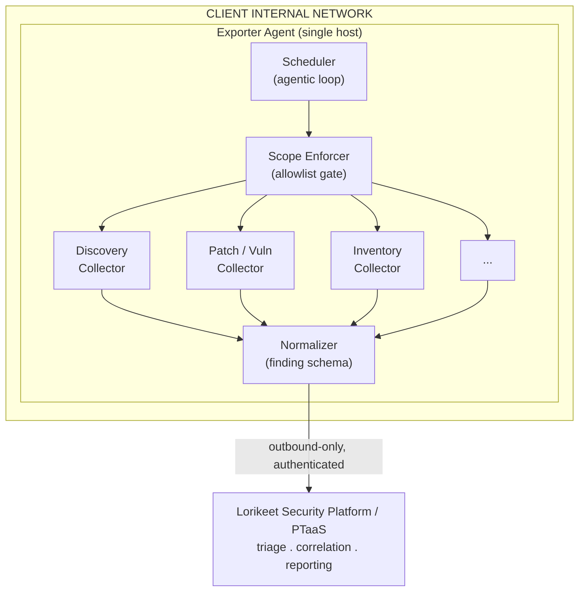

# lorikeet-security-agent-exporter


An **agentic exporter** for internal network reconnaissance and security posture assessment. Deployed inside a client environment, the exporter autonomously enumerates hosts, collects patch and vulnerability state, inventories servers and applications, and streams normalized findings back to the **Lorikeet Security** platform for triage, correlation, and reporting.

It exists to close the detection gap between point-in-time engagements: instead of a once-a-year snapshot, the exporter gives continuous, always-on internal visibility, the live internal attack-surface picture that scheduled pentests miss.

---

## Table of Contents

- [Overview](#overview)
- [Why an agentic exporter](#why-an-agentic-exporter)
- [Capabilities](#capabilities)
- [Architecture](#architecture)
- [Collector modules](#collector-modules)
- [Finding schema](#finding-schema)
- [Scope & authorization](#scope--authorization)
- [Installation](#installation)
- [Configuration](#configuration)
- [Running the agent](#running-the-agent)
- [Licensing](#licensing)
- [Authentication](#authentication)
- [Operational security](#operational-security)
- [Roadmap](#roadmap)
- [Contributing](#contributing)
- [License](#license)

---

## Overview

The Lorikeet Security Agent Exporter is a lightweight, self-directed collection agent that runs on the inside of a network. Once authorized and scoped, it performs continuous discovery and assessment without requiring an operator to drive each scan. Results are normalized into a consistent finding schema and shipped over an authenticated, outbound-only channel to the Lorikeet Security platform, where they feed into PTaaS workflows, dashboards, and reporting.

Think of it as the internal-network analogue to external attack-surface management: persistent, prioritized, and built to surface what changed and what is newly exploitable, not just what existed at scan time.

---

## Why an agentic exporter

Traditional internal assessment is episodic. A tester connects, runs a fixed scan profile, exports results, and leaves. Between engagements the network drifts: hosts are added, patches lapse, services get exposed, and configurations rot. None of that is visible until the next engagement.

The agentic model changes the loop:

- **Continuous, not point-in-time.** The agent runs on a cadence (or continuously) and tracks state over time, so drift and regressions are caught as they happen.
- **Self-prioritizing.** Rather than re-running an identical scan list, the agent decides what to look at next based on what it has already found: new hosts, changed services, high-severity exposures.
- **Low-touch deployment.** A single agent inside the perimeter replaces ad-hoc tooling and manual data collection.
- **Platform-native.** Findings land directly in the Lorikeet Security platform in a structured form, ready for correlation against external ASM data and prior engagement history.

---

## Capabilities

### Host & service discovery
Sweeps authorized internal ranges, fingerprints live hosts, identifies open ports, and classifies exposed services. Tracks newly appeared and newly disappeared hosts between collection cycles.

### Patch & vulnerability state
Collects OS patch levels and installed-package manifests, then maps them against known-CVE data to flag missing patches, end-of-life software, and known-exploitable versions. Prioritizes by severity and exploitability rather than raw CVE count.

### Server & application inventory
Builds and maintains a running inventory of operating systems, installed software, running services, listening ports, and notable configuration. Detects configuration drift and inventory changes over time.

### Patch-management visibility
Surfaces patch compliance posture across the fleet: which hosts are current, which are lagging, and which carry known-exploited vulnerabilities, so remediation can be prioritized where it matters.

### Structured findings export
Normalizes all collected data into a single finding schema and streams it to the platform over an authenticated channel for triage, deduplication, and reporting.

### Agentic operation
Runs unattended. Schedules its own collection cycles, sequences modules, and adapts its focus to the current state of the environment.

---

## Architecture



**Design principles**

- **Scope enforcement is a hard gate, not a filter.** Every target is checked against the configured allowlist before any collector touches it. Out-of-scope hosts are never contacted.
- **Outbound-only.** The agent initiates all connections to the platform; the platform never reaches into the network.
- **Modular collectors.** Each collector is independently enable/disable-able so deployments can be tuned to the engagement.

---

## Collector modules

| Module       | Collects                                                                 | Notes |
| ------------ | ------------------------------------------------------------------------ | ----- |
| `discovery`  | Live hosts, open ports, service fingerprints, host churn                 | Baseline module; recommended always-on |
| `patch`      | OS patch level, installed-package manifest, CVE mapping, EOL software    | Severity- and exploitability-prioritized |
| `inventory`  | OS/version, installed software, running services, config drift           | Tracks change over time |
| `posture`    | Patch-compliance rollup across the fleet, known-exploited flags          | Built on `patch` + `inventory` output |

Modules are selected in configuration via the `modules` setting. Disabled modules consume no resources and contact no hosts.

---

## Finding schema

All collectors emit findings in a single normalized envelope so the platform can ingest them uniformly:

```json
{
  "finding_id": "uuid",
  "agent_id": "uuid",
  "collected_at": "2026-06-06T00:00:00Z",
  "module": "patch",
  "target": {
    "host": "10.0.4.12",
    "hostname": "app-prod-04",
    "in_scope": true
  },
  "category": "missing-patch",
  "severity": "high",
  "title": "Missing OS security update",
  "evidence": {
    "cve": ["CVE-2026-XXXXX"],
    "installed_version": "1.2.3",
    "fixed_version": "1.2.7"
  },
  "first_seen": "2026-06-01T00:00:00Z",
  "last_seen": "2026-06-06T00:00:00Z",
  "state": "open"
}
```

`first_seen`, `last_seen`, and `state` give the platform the temporal context needed to distinguish new exposures from persistent ones and to auto-close findings that have been remediated.

---

## Scope & authorization

> **This tool is for authorized internal assessment only.**

The exporter enforces an explicit scope definition and will **not** collect against hosts outside the configured allowlist. The scope enforcer runs as a code-level gate ahead of every collector; there is no mode in which the agent operates without a scope.

Deploy only on networks you own or are **contractually engaged** to test. Unauthorized scanning of networks you do not control may be illegal in your jurisdiction.

---

## Installation

**Requirements:** Python 3.11+

```bash
git clone https://github.com/<org>/lorikeet-security-agent-exporter.git
cd lorikeet-security-agent-exporter

# create and activate a virtual environment
python -m venv .venv
source .venv/bin/activate

# install the package (registers the lk-exporter console script)
pip install -e .
```

This installs the `lk-exporter` console entry point on your `PATH`. The agent is designed to run on a single host inside the target subnet; dependencies are pinned in `pyproject.toml`.

---

## Configuration

Configuration is supplied via a YAML config file (default `config.yaml`) or environment variables. Environment variables take precedence over file values.

| Setting        | Required | Description                                                        |
| -------------- | -------- | ------------------------------------------------------------------ |
| `scope`        | yes      | CIDR ranges / hostnames the agent is authorized to touch           |
| `platform_url` | no       | Lorikeet Security platform ingest endpoint (omit for standalone / self-hosted sink) |
| `license_key`  | ingest   | Required only for Lorikeet Security platform ingest (see [Licensing](#licensing)) |
| `agent_token`  | ingest   | Required only for platform ingest; authenticates the agent (see [Authentication](#authentication)) |
| `interval`     | no       | Collection cadence (`continuous`, or e.g. `6h`, `24h`)             |
| `modules`      | no       | Enabled collectors: `discovery,patch,inventory,posture`            |
| `concurrency`  | no       | Max parallel host operations (rate-limit friendly)                 |
| `log_level`    | no       | `info` (default), `debug`, `warn`, `error`                         |

Example:

```yaml
scope:
  - 10.0.0.0/16
  - 192.168.50.0/24
platform_url: https://lorikeetsecurity.com/ingest
license_key: ${LK_LICENSE_KEY}
agent_token: ${LK_AGENT_TOKEN}
interval: 6h
modules:
  - discovery
  - patch
  - inventory
  - posture
concurrency: 16
log_level: info
```

---

## Running the agent

```bash
# show version and licensing info
lk-exporter --version

# quick config check (validates config.yaml and exits)
lk-exporter --test-config

# one-shot collection cycle
lk-exporter run --once

# continuous agentic operation
lk-exporter run

# point at a specific config file
lk-exporter run --config /etc/lorikeet/config.yaml

# also start the MCP stdio server alongside the agent
lk-exporter run --mcp

# full validation of config, scope, and platform reachability
lk-exporter validate
lk-exporter validate --config /etc/lorikeet/config.yaml

# start MCP stdio server only (no collection)
lk-exporter mcp
```

The CLI is also available as a module if the console script is not on your `PATH`:

```bash
python -m lk_exporter run --once
```

**`--test-config`** is a quick sanity check for the default `config.yaml`: it validates the file, enumerates the scope, and (if `platform_url` is set) checks the license key and platform reachability, then exits. For a non-default config path use `lk-exporter validate --config path`.

**`validate`** is recommended before every new deployment. It confirms the scope parses correctly and the allowlist is non-empty, and, if platform ingest is configured, that the license key is valid and the endpoint is reachable and authenticated, without contacting any target hosts.

---

## Licensing

The agent is open source (MIT) and runs freely. You can clone it, read it, fork it, and run collection against your own scope without any key.

A **license key** is required only to **ingest findings into the hosted Lorikeet Security platform**. It is the platform entitlement, not a gate on the software itself. The key is separate from the `agent_token`: the license authorizes platform ingest, the token authenticates the connection. If you are running the agent standalone or exporting to your own sink, no license key is needed.

License keys are issued per customer from the Lorikeet Security platform and take the form:

```
lk_lic_<32 hex chars>
```

When a `platform_url` pointing at the Lorikeet Security platform is configured, the agent validates the license key online before streaming findings. If the key is missing, malformed, expired, or revoked, platform ingest is rejected; local collection still runs and can be exported elsewhere. License validation is also exercised during `lk-exporter validate`.

License keys may encode entitlements such as seat/agent count, enabled hosted features, and an expiry date, which the platform enforces at validation time. Treat the license key as a secret:

- Supply it via environment variable or secret manager, never commit it to the repo.
- Contact Lorikeet Security to rotate, extend, or revoke a key.

> Online validation means platform ingest requires outbound reachability to the platform. This does not affect standalone or self-hosted-sink operation.

---

## Authentication

The agent authenticates to the platform with a per-agent token in the form:

```
lk_agent_<32 hex chars>
```

Tokens are issued per deployment from the Lorikeet Security platform and scoped to a single engagement. Treat the token as a secret:

- Supply it via environment variable or secret manager, never commit it to the repo.
- Rotate it if it is ever exposed.
- Revoke it from the platform when the engagement ends.

All traffic to the platform is authenticated and uses TLS; the channel is outbound-only.

---

## Operational security

- **Scope-gated by default.** No collection runs without an explicit allowlist.
- **License-gated ingest.** Platform ingest requires a valid, online-verified license key; standalone collection runs without one.
- **Outbound-only transport.** The platform never connects into the client network.
- **Least privilege.** Run the agent with the minimum access needed for its enabled modules.
- **Auditable.** Every collection cycle is logged with what was touched and what was found.
- **No exfiltration of payloads.** The agent exports findings and metadata, not bulk data or file contents.

---

## Roadmap

Earlier phases harden the core collection loop; later phases deepen accuracy, broaden coverage, and extend orchestration on top of the existing MCP integration.

```
Phase 1  ##################..  ~90%   Core hardening        (current)
Phase 2  ####................  ~20%   Accuracy & depth
Phase 3  ....................    0%   Coverage expansion
Phase 4  ###.................  ~15%   Orchestration         (MCP shipped)
Phase 5  ....................    0%   Intelligence
```

**Phase 1 - Core hardening** `in progress`
Agentic scheduler and scope-enforcement gate, normalized finding schema with temporal state, outbound-only authenticated transport with token rotation, `discovery` / `patch` / `inventory` collectors to GA, MCP orchestration *(shipped)*.

**Phase 2 - Accuracy & depth** `planned`
Credentialed deep inventory, authenticated config-audit collectors (CIS-style), service-level fingerprinting, confidence scoring, dedup and correlation against history.

**Phase 3 - Coverage expansion** `planned`
Active-Directory-aware discovery, pluggable CVE / threat-intel feeds, KEV and EPSS prioritization, cloud and hybrid asset discovery, container / Kubernetes collectors.

**Phase 4 - Orchestration & automation** `partially shipped`
On-demand collection over MCP, multi-agent coordination across segmented networks, remediation-tracking loop with auto-close, alerting and webhooks for high-severity findings.

**Phase 5 - Intelligence** `planned`
Risk-based prioritization (exploitability x exposure x criticality), attack-path mapping, drift baselining with anomaly detection, optional safe-validation of select findings.

---

## Contributing

Contributions are welcome. Please open an issue to discuss substantial changes before submitting a pull request, keep collectors modular and scope-safe, and include tests where practical. By contributing you agree your contributions are licensed under the MIT License.

> Authorized use only: regardless of license, this tool is for assessing systems you own or are explicitly authorized to test. Do not use it against systems without permission.

---

## License

MIT License. Copyright (c) Lorikeet Corp (operating as Lorikeet Security).

See [LICENSE](LICENSE) for the full text. The MIT grant covers this agent and its source. The hosted Lorikeet Security platform and the issuance of license keys for platform ingest are separate commercial offerings and are not covered by this license.
